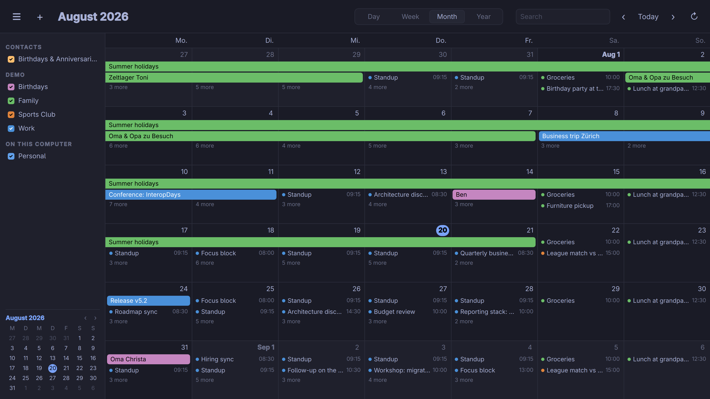
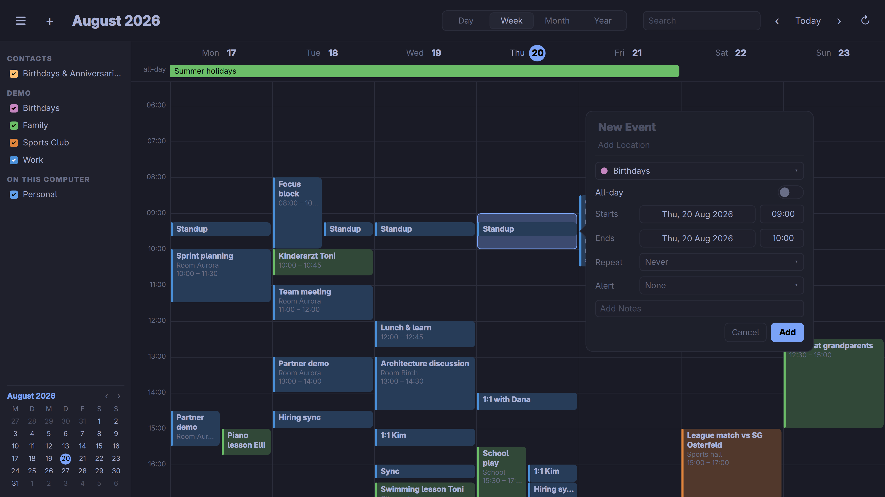

# Omacal

A calendar app built with Qt Quick and C++ that automatically follows the omarchy theme and system dark/light mode.

Events live in [evolution-data-server](https://gitlab.gnome.org/GNOME/evolution-data-server), so Omacal does not carry its own account setup: add Google, Nextcloud, Microsoft 365, or any CalDAV server once in `gnome-online-accounts-gtk`, and those calendars simply appear here — sign-in, OAuth token refreshes, and syncing are the daemon's job.

The layout follows Apple Calendar on macOS: a sidebar with your calendars and a mini month, and day, week, month, and year views.





More: [week](screenshots/week.png), [day](screenshots/day.png), [year](screenshots/year.png).

## Install

Install the Arch package with `./bin/install`, or build just the binary with `./bin/build`.

## Using it

- **Create** an event by double-clicking a day or a time slot, or by dragging out a span — down the hour grid for a timed event, across the all-day strip or the month grid for an all-day one.
- **Edit** by double-clicking an event; a single click selects it. Drag an event to move it, or drag its top and bottom edges in the day and week views to change its start and end.
- **Repeat** an event daily, weekly, monthly or yearly, or open "Custom…" for the full rule: an interval ("every 2 weeks"), weekday toggles, a day-of-month grid or an "on the last Friday" ordinal, month selection for yearly rules, and an end after N times or on a date. Rules written by other clients are shown in plain language and left untouched unless you edit them.
- **Alerts** stack up like Apple's: several per event, from presets or a custom offset in minutes, hours or days, before or after the start.
- **Notes** render Markdown-ish HTML — the subset Google Calendar writes — with clickable links and selectable text; click the text to edit the source.
- **Right-click a calendar** in the sidebar to rename it or change its color.

Changing or deleting an occurrence of a repeating event asks what it should apply to: this occurrence, this and all future ones (unless you are on the first), or the whole series. Series-wide time changes shift every occurrence by the amount the edited one moved.

## Shortcuts

- `Ctrl+1` – `Ctrl+4` switch between the day, week, month, and year views.
- `Ctrl+T` or `Home` jumps to today.
- Arrow keys move the focused day (`Up`/`Down` by a week); `PgUp`/`PgDn`, `Ctrl+Left`, and `Ctrl+Right` move by the current view's period.
- `Return` creates an event on the focused day; `Ctrl+N` creates one now.
- `Delete` removes the selected event; `Ctrl+Z` and `Ctrl+Shift+Z` (or `Ctrl+Y`) undo and redo changes.
- `Ctrl+F` searches all calendars, `Up`/`Down` walk the results and `Return` jumps to one.
- `Ctrl+R` syncs all calendars.
- `Ctrl+S` toggles the sidebar.
- `Super+F` toggles fullscreen. Qt maps this key as `Meta+F`.
- `Ctrl+Q` quits.

## Calendars

Add an account in `gnome-online-accounts-gtk` — Google, Nextcloud, Microsoft 365, or a plain CalDAV or webcal URL — and its calendars show up here automatically, grouped by account. Local calendars work without any account at all. Ticking a calendar on and off is stored in the source itself, so the choice sticks across restarts and applies to every program reading the same data. Calendars without a color of their own are tinted from the omarchy theme's palette.

Renaming or recoloring a CalDAV calendar (Google included) is written back to the server, and the server's own name and color are read on startup and on every sync — so a color set in Google Calendar or on a Mac shows up here, and one set here shows up there. Evolution-data-server does neither of those by itself; Omacal talks to the server through EDS's WebDAV session, which supplies the account's credentials, so no separate sign-in is involved. Names stay local where the account forbids renaming (GNOME Online Accounts does this for Google), and webcal subscriptions are read-only by nature.

Search covers the past eight and next six months — the same window GNOME Calendar uses — and lists real occurrences ordered by closeness to now, upcoming first.

## Theming

Colors come from the active omarchy theme (`~/.local/state/omarchy/current/theme/colors.toml`) and re-apply live on theme switches; dark/light mode follows the XDG desktop portal. The interface uses the system's regular font and the desktop text size — `omarchy display text size`, or GNOME's `text-scaling-factor` — and re-flows without a restart.

## Development

```sh
./bin/build        # build build/omacal
./bin/test         # unit tests, plus the date and recurrence checks (needs node)
./bin/demo-data    # fill EDS with a demo account and a busy year of events
./bin/demo-data --remove
./bin/install      # makepkg -fsi
```

`bin/demo-data` creates a "Demo" provider with Work, Family, Sports Club, and Birthdays calendars, filled with a realistic schedule spanning a year around today — recurring meetings, multi-day trips, all-day events that overlap, alerts, and notes of every length. It needs `python-gobject`. Reruns replace the data rather than duplicating it.

Set `OMACAL_PERF=1` to print startup and reload timings. Qt sends application logging to the journal when stderr is not a terminal, so pair it with `QT_FORCE_STDERR_LOGGING=1` to see that output — and any QML warnings — on the console.

### Layout

- `src/backend.cpp` — omarchy theme colors, dark mode, text scale, remembered window state.
- `src/calendarstore.cpp` — everything evolution-data-server: calendars, occurrence expansion, creating and editing events, recurrence scopes, undo/redo, search, and the CalDAV metadata sync.
- `src/systemtheme.cpp` — dark mode and text scale from the desktop portal.
- `src/*.qml` — the interface; `src/Calendar.js` holds the date and layout math, `src/Recurrence.js` parses, builds and describes RRULEs.

## Requirements

- Qt 6: `qt6-base`, `qt6-declarative` (built with GLib event loop support, the Arch default)
- `evolution-data-server`
- `gnome-online-accounts-gtk` to add Google, Nextcloud or Microsoft 365 accounts (not needed for local or plain CalDAV calendars)
- `xdg-desktop-portal` and a portal backend
